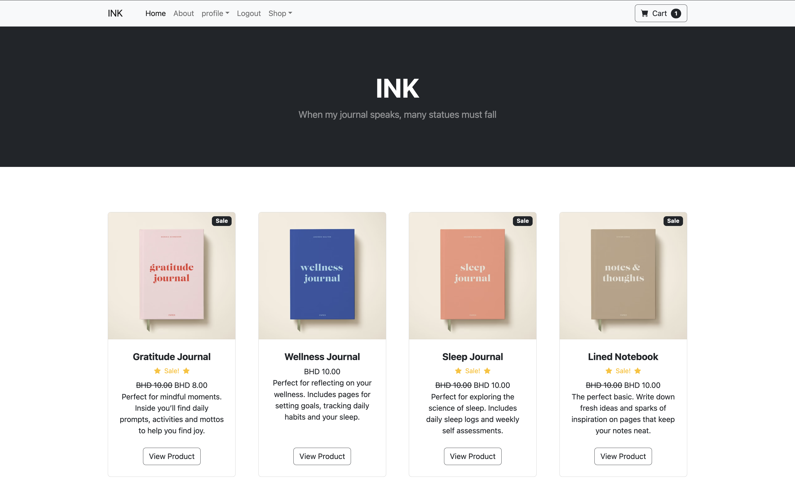
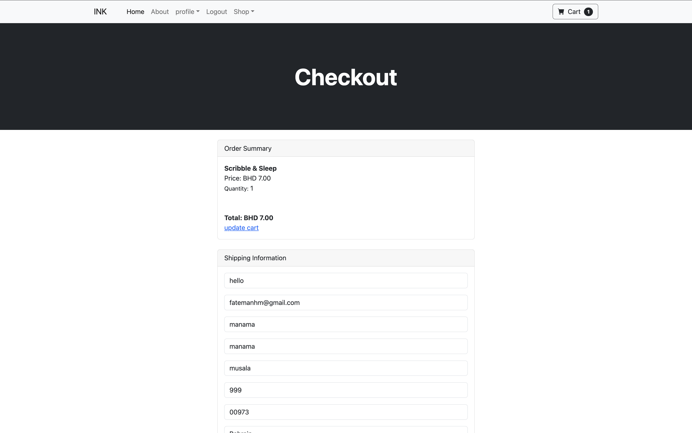
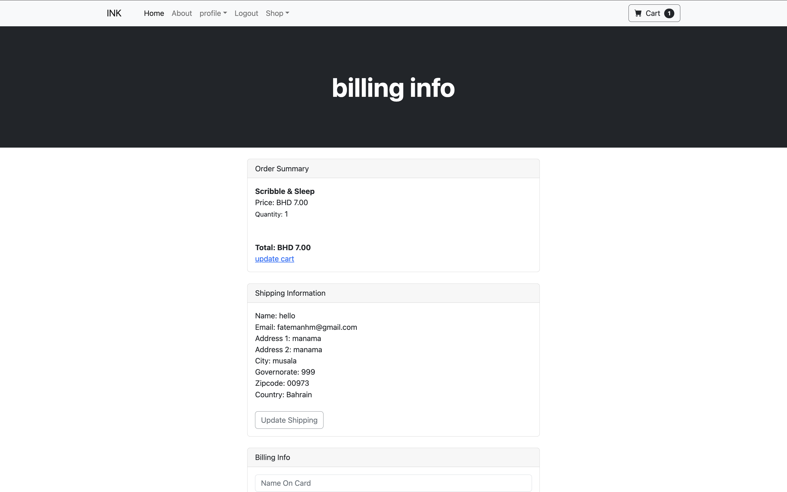
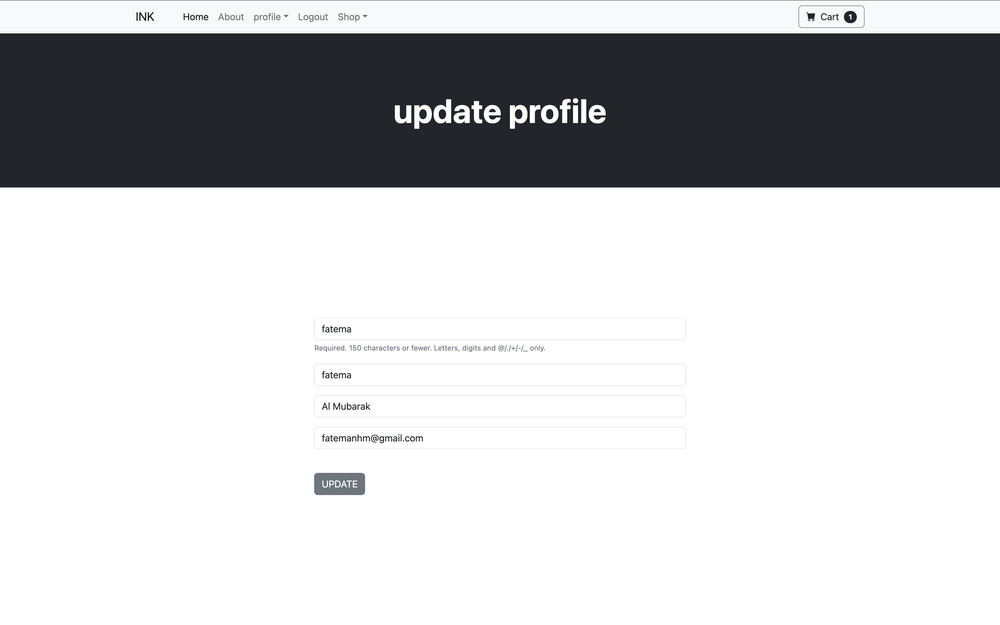

# INK Journals E-Commerce Web Application

A fully functional e-commerce web application built with Django that allows users to browse products, manage their shopping cart, place orders, and update their profiles. This project demonstrates a robust foundation for an online shopping experience, combining user-friendly features with a scalable backend.

## Screenshots

### Home Page

### Cart Summary

### Checkout Page

### Checkout Page

---

## Features

### **User Management**
- User registration, login, and logout.
- Update personal and shipping information.
- Profile-based cart management.

### **Product Management**
- View all available products categorized into different categories.
- View detailed product information, including price, description, and sale price.

### **Shopping Cart**
- Add, update, or remove products.
- Persist cart data across sessions.
- Dynamic cart summary with real-time totals.

### **Order Processing**
- Secure order placement with or without user authentication.
- Capture shipping and billing details during checkout.
- Store order history in the database.

### **Admin Dashboard**
- Manage products, categories, and orders through the Django admin interface.

---

## Deployment

Access the live application here:  
[**Deployment Link**](https://example-deployment-link.com)

---

## Technologies Used

- **Frontend**: HTML, CSS, JavaScript
- **Backend**: Django
- **Session Management**: Django's session framework
- **User Authentication**: Django's built-in authentication system
- **AJAX**: For dynamic cart updates

